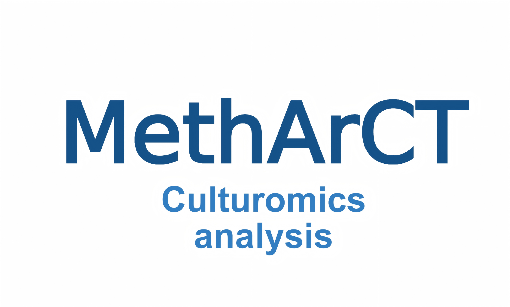

<p align="center">
  
</p>

# MethArCT - Methanogenic Archaeal Culturomics Toolkit

## Overview

MethArCT (Methanogenic Archaeal Culturomics Toolkit) is a comprehensive toolbox designed for metagenomic and genomic analysis of methanogenic archaea. It integrates multiple bioinformatics analysis functions to predict microbial metabolic pathways, optimal growth temperature, salinity adaptation, pH preference, antibiotic resistance, and cultivability.

Access MethArCT v0.1.0 online at [http://methardb.cn/tools/diamond](http://methardb.cn/tools/diamond) for protein-based functional prediction of methanogenic archaea.
Access MethArCT v0.6.0 online at [http://methardb.cn/tools/metharct-beta](http://methardb.cn/tools/metharct-beta)) for protein-based functional prediction of methanogenic archaea.

## Key Features

### Core Features (Required)
- **Metabolic Pathway Prediction**: Analysis of methane, sulfur, and nitrogen metabolic pathways (21 pathways) based on Diamond tool
- **Cultivability Assessment**: Evaluation of culture difficulty based on metabolic pathways

### Extended Features (Optional)
- **Salinity Prediction**: Microbial salinity adaptation prediction based on amino acid composition features using SuSha ensemble learning model
- **Temperature Prediction**: Optimal Growth Temperature (OGT) prediction — requires Tome tool
- **pH Prediction**: Growth pH preference prediction (optimum, maximum, minimum) based on genome-wide amino acid composition features using GenomeSpot Lasso regression models
- **Antibiotic Resistance Prediction**: Supports prediction of Bacitracin, Tunicamycin, and Vanadate resistance.
- **Genome Quality Assessment**: Genome completeness and contamination estimation based on CheckM2 — requires CheckM2 tool

## Quick Start

```bash
# 1. Install MethArCT
pip install .

# 2. Run comprehensive analysis
metharct comprehensive "protein.faa" -o results/
```

## System Requirements

### Basic Requirements
- **Python**: >= 3.9
- **Required Tool**: Diamond
- **Operating System**: Windows, Linux

### Optional Tools
- **Tome**: For OGT prediction (optional)
- **CheckM2**: For genome quality assessment (optional)

## Quick Installation

### Step 1: Get the Project
```bash
git clone https://github.com/rsj99-dev/MethArCT.git
cd MethArCT
```

### Step 2: Create Python Environment
```bash
# Using conda (recommended)
conda env create -f environment.yml
conda activate metharct

# Or using pip with virtual environment
python -m venv metharct_env
# Windows activation:
metharct_env\Scripts\activate
# Linux/macOS activation:
source metharct_env/bin/activate
```

### Step 3: Install Dependencies
```bash
# Install Python dependencies
pip install -r requirements.txt

# Install project as executable
pip install -e .

# Install Diamond (required)
conda install -c bioconda diamond
```

> **Windows Note**: If `conda install diamond` fails, manually download `diamond.exe` from [Diamond Releases](https://github.com/bbuchfink/diamond/releases) and place it in the **MethArCT-main root directory**.

### Step 4: Verify Installation
```bash
# Test core functionality
python quick_test.py

# Check command line tool
metharct --help
```

## Optional Tools Installation

For temperature prediction or genome quality assessment features:

### CheckM2 Installation (Genome Quality Assessment)
```
Extract "checkm2_db.zip" to the root directory of the MethArCT folder.
```

## Usage Guide

### 1. Command Line Usage (Recommended)

**Core Analysis (Diamond only)**:
```bash
# Metabolic pathway analysis — core feature
metharct diamond "protein.faa" -o results/

# Comprehensive analysis (skip optional tools)
metharct comprehensive "protein.faa" -o results/ --skip-tome --skip-checkm2 --skip-antibiotic
```

**Full Analysis (with optional tools)**:
```bash
# Complete analysis with all features
metharct comprehensive "protein.faa" -o results/

# Run optional analyses separately
metharct susha "protein.faa" -o results/         # Salinity prediction
metharct ph "protein.faa" -o results/            # pH preference prediction
metharct antibiotic "protein.faa" -o results/    # Antibiotic resistance prediction
metharct tome "protein.faa" -o results/          # Requires Tome
metharct checkm2 "genome.fasta" -o results/      # Requires CheckM2
```

### 2. Python Script Usage
```python
from metharct import MethArCTAnalyzer

analyzer = MethArCTAnalyzer()

# Core functionality only (Diamond analysis)
results = analyzer.analyze_diamond('protein_sequences.faa')

# Antibiotic resistance prediction
results = analyzer.analyze_antibiotic('protein_sequences.faa')

# Full analysis (if optional tools are installed)
results = analyzer.comprehensive_analysis('protein_sequences.faa')

print(results)
```

### 3. Input File Requirements

- **Supported Format**: FASTA format (.fa, .fasta, .faa)
- **File Size**: Recommended not exceeding 50MB
- **Character Encoding**: UTF-8
- **File names with special characters** (e.g., parentheses, spaces) should be quoted

### 4. Output Description

**Core Feature Output (Diamond Analysis)**:
- `[filename]_diamond_summary.csv` — Metabolic pathway summary
- `[filename]_diamond_results.json` — Detailed analysis results
- `[filename]_*_diamond.tsv` — Detailed alignment results for each pathway

**Antibiotic Resistance Prediction Output**:
- `antibiotic_selection_results.tsv` — AAI values, rule evaluation status, and recommended antibiotics

**Comprehensive Analysis Report**:
- `[filename]_integrated_summary.csv` — Integrated assessment results
- `[filename]_comprehensive_analysis.json` — Complete analysis data

**Optional Feature Outputs**:
- SuSha salinity results: `[filename]_SuSha_Summary.tsv` and `[filename]_SuSha_Result.xlsx`
- pH preference results: `[filename]_pH_Summary.tsv` and `[filename]_pH_Details.json`
- Tome results in `[filename]_tome/` directory
- CheckM2 results in `[filename]_checkm2/` directory with `quality_report.tsv`

## Troubleshooting

### Installation Issues

**Command line entry point not working**:
```bash
# Alternative way to run
python -m metharct.cli.main --help

# Reinstall project
pip uninstall metharct -y
pip install -e .
```

**Diamond tool not found**:
```bash
conda activate metharct
conda install -c bioconda diamond
diamond --help
```

**Windows: Diamond not found**:
If conda install fails, manually download `diamond.exe` and place it in the MethArCT root directory:
1. Visit https://github.com/bbuchfink/diamond/releases
2. Download the latest `diamond-windows.zip` and extract `diamond.exe`
3. Place `diamond.exe` in the MethArCT-main root folder
4. Re-run the analysis command

**pH prediction module not available**:
```bash
pip install hmmlearn>=0.3.0
```

**SuSha salinity prediction fails with module/import errors**:
The SuSha ensemble model requires `imbalanced-learn`. Make sure it is installed:
```bash
pip install imbalanced-learn>=0.10.0
```

## LoongArch Support

> **Note**: The LoongArch branch currently supports only the following processors:
> Loongson 3A/B/C/D 5000 & 6000 series, 2K2000, and 2K3000/3B6000M.

## Project Structure

```
MethArCT/
├── metharct/                       # Main package
│   ├── cli/                        # Command line interface
│   ├── core/                       # Core analysis modules
│   │   ├── antibiotic_analyzer.py  # Antibiotic resistance prediction (AAI-based)
│   │   ├── susha/                  # SuSha salinity prediction (embedded)
│   │   └── ph_predictor/           # pH prediction engine (embedded, GenomeSpot-based)
│   │       ├── models/             # Pre-trained Lasso regression models
│   │       └── hmm/                # Signal peptide HMM model
│   └── utils/                      # Utility functions
├── Tome-1.1.0/                     # Tome OGT prediction module
├── data/                           # Reference databases
│   ├── databases/                  # Diamond databases
│   │   └── kangshengsu/            # Methanogen reference genomes for antibiotic prediction
│   ├── methane/                    # Methane metabolism genes
│   ├── nitrogen/                   # Nitrogen metabolism genes
│   └── sulfur/                     # Sulfur metabolism genes
├── requirements.txt                # Python dependencies
└── setup.py                        # Package setup
```

## License

This project is licensed under the **GNU General Public License v3.0 (GPL-3.0)** — see the [LICENSE](LICENSE) file for details.

**License history:**
- Versions **≤ 0.5.5** were released under the **MIT License** — see [LICENSE-MIT](LICENSE-MIT) for the original terms.
- Starting from version **0.6.0**, the project is relicensed under **GPL-3.0** to comply with GPL-3.0 licensed dependencies (Tome, CheckM2).

**Third-party components:**
- **Tome** (OGT prediction) — GPL-3.0
- **CheckM2** (genome quality assessment) — GPL-3.0

## Citation

If you use MethArCT in your research, please cite:

[Coming soon]
